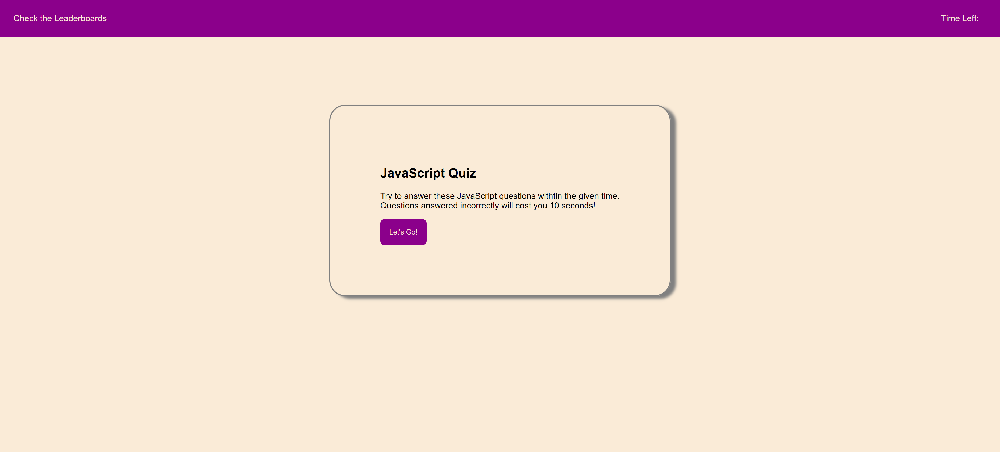

# pop-quiz

## Description

The purpose of this app is to allow users to test their knowledge with a quick JavaScript quiz which is timed and uses the time as the final score. After finishing the quiz they can store their initials and score on the leaderboard to compare with others who took the quiz.

## Technologies used
* HTML
* CSS
* JavaScript

### Links

[Link to the git repository](https://github.com/Alex-Soucy/pop-quiz)

[Link to the deployed page](https://alex-soucy.github.io/pop-quiz/)
